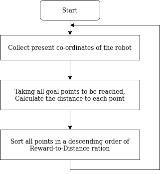
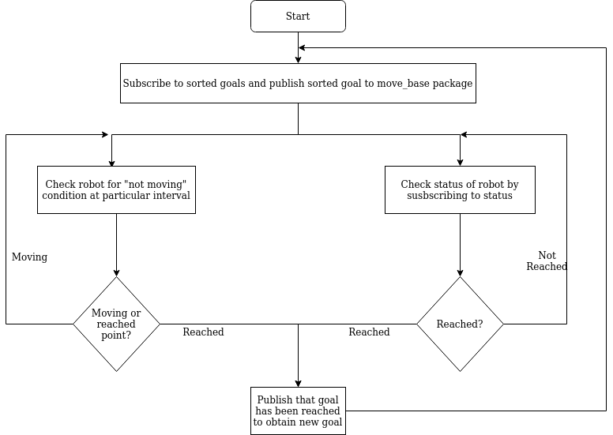

# Obstacle Avoidance using Move_Base package and reaching goals - Team *Star-Force*

## Team Members  
- Bhuvan Harlapur
- Avinash Bhat

## Objective

Environment is containing of many objects such as cones, rectangular blocks, house structure and maze. Also there exists Multi-robots which are also looking for goals at the same time. Main objective of this project is to reach goal by using move_base package, sometimes move_base package fails to plan path for the goal due to small gap between obstacles. This should be captured and robot should be allocated to go towards other goal, in-case of failure in planning.  

Repository contains of source code file named **gerty**  and a launch file named **start.launch**.
Launch file will include *sorting_goals* package too.


## Steps to launch program for competition

After launching multi robot environment ->
Start gerty package to see robot moving
```bash
roslaunch gerty start.launch robot_id:=1/2/3/4
```


## Sorting of Goal Points

Main objective is to gain reward points, therefore it is of no use if we use goal points as it is. We are sorting goals in such way that, we cover less distance to get huge rewards. This can be achieved by calculating Reward to distance ratio at from the robot position. Each point will be at different distance with different rewards. So Reward to distance ratio will give us the best possible point nearby.




### Advantages of this sorting method
- Gains more reward in short period of Time
- Distance covered will be less

### Disadvantages of this sorting method
- If two, nearby goal points are separated from the obstacle, then robot have to go all the way around the obstacle.
- If there exists any point at very near to the robot with less reward, then it will not consider it for the next goal.


## General Description of the Project
We have created 2 packages in-order to run our robot. First is to take the goal from **/goals** topic and to publish the sorted goals. Second one is for subscribing to the sorted goals and then publishing it to the **/move_base/goal**. This also publishes continuously about the status of the robot by using **get_robo_stat** topic.

Included Topics:
1. **/goals** - All goal points are published into this topic and we are subscribing it to obtain the goals.

2. **/move_base/goal** - It is a topic where goal points need to be published. We will be publishing goals on to move_base, so that it will create a plan and runs according to that.

3. **/amcl_pose** - This topic helps us to find the exact position of the robot by localization. This applies Monte-Carlo localization technique for finding positions.

4. **/cmd_vel** - It is a topic which helps us to give velocity as an input, in-order to move the robot around. At the beginning, it is important to localize robot accurately, for this robot need to be turned one full rotation. For this purpose, we make one rotation by publishing velocity to it.

5. **/get_robo_stat** - It is a custom message to publish the different status of the robot. Status such as, **Moving** (While moving towards goal), **Difficult-to-reach** (When robot fails to reach goal), **rotated** (soon after first rotation for localization is done).

## Algorithm Description

Once goals have been sorted according the algorithm, this goals need to be published to the one of the move_base topic. Once it is published, work is not done!. Because as we know, once goal has been reached, we have to give other goal to move towards. Also, if robot fails to move towards goal, after few trials move_base will abort the mission. That's why it is always important to keep checking the movement of the robot. So we check the distance covered by robot at particular interval of time. If robot fails to move specified distance in the given time, then it will consider that goal to be difficult to reach and publishes that status. Then new goal will be given from the sorting package and starts moving towards next goal.

Flowchart for the robot moving code:




### Disadvantages of move_base package
- Robot gets stuck at positions, where gap present in the path is very less
- Robot fails to turn in case of obstacles present behind or on sides

### When robot could not able to travel through the path for longer!!!!
 In-order to avoid time waste while in searching of goals which are hard to reach, we will be checking the total distance covered by robot at particular period of time. When robot fails to reach specified distance within particular time, we consider the goal as difficult to reach and skip that goal. Because we do not want to waste time in search of nearly impossible goals.

### when move_base planner Aborts!!!!
When move_base does try it's all recovery possibilities and fail, it will abort the mission. When this happens, our robot look around it's Environment and finds available space. According to the space availability, it will move forward/backward/rotate and then publishes goal to move_base package again.

### Handling of missed goal Points
All missed goals will be saved in an array and once it finishes trying all goals to reach, these goals will be published to another topic. This topic will take missed goals and tries to reach these goals again.

We tried for this, but unfortunately we could not finish it on given time. So we consider this as our future work scope.


### Tuning move_base and amcl parameters for better output
move_base package can be made more efficient by changing few parameters from it. We have carried out few experiments to check it's effect on the robot. We have used following parameter values in-order to obtain better results:
- yaw_goal_tolerance
- xy_goal_tolerance


## Testing
Packages committed into gitlab Repositories can be tested using bash commands. We have written few tests to check whether our package is working fine or not.

Testing files added are:
- checking for sorted goal Publisher
- checking for goal publisher to move_base
